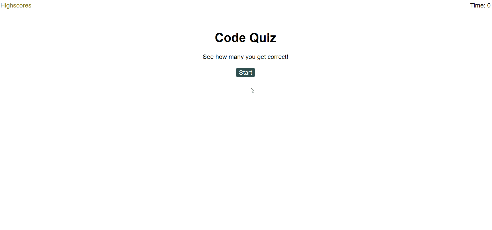

# Code-Quiz
## Description
A timer-based quiz application that stores high scores client-side.

## Description
A timer-based quiz application that stores high scores client-side.

### Table of Contents
* [Installation](#installation)
* [Demo](#demo)
* [Credits](#credits)

## Installation
In your terminal type:
```git clone https://verlitas.github.io/Code-Quiz/```
* Open in Visual Studio to build and run.
* For further instructions, visit https://help.github.com.

## Demo

Live Link: https://verlitas.github.io/Code-Quiz/

## Credits
[UABootCamp](https://bootcamp.ce.arizona.edu/coding/)  
